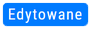
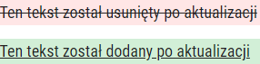
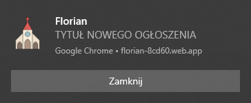
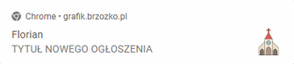
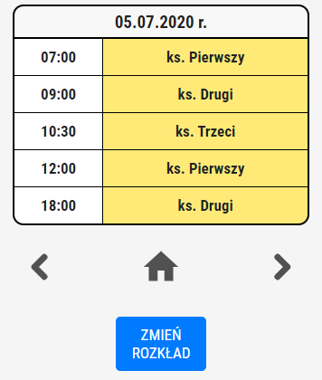
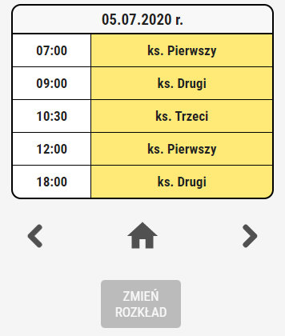

[](https://florian-8cd60.web.app/)

# Florian - grafik

> Progresywna aplikacja webowa, z panelem administracyjnym, przedstawiająca grafik niedzielnych Mszy św.

 </br>


## Instalacja

Progresywna aplikacja webowa (PWA) pozwala na przeprowadzenie instalacji z poziomu przeglądarki (zalecany Google Chrome).
|Instrukcja |Załącznik |
| ------------------------------------------------------ | :----------------------------------------: |
| 1. Odwiedź stronę https://florian-8cd60.web.app/ | |
| 2. Na pasku adresu wciśnij przycisk z symbolem "plusa" |  |
| 3. Wybierz "Zainstaluj" |

## Ogłoszenia

Aplikacja wyświetla najnowsze ogłoszenia parafialne, które pobierane są z API oficjalnej strony parafii.

| :exclamation: WAŻNE :exclamation:                                                                                                                                                                                                                                                                                           |
| --------------------------------------------------------------------------------------------------------------------------------------------------------------------------------------------------------------------------------------------------------------------------------------------------------------------------- |
| Darmowy plan [Firebase Spark](https://firebase.google.com/pricing) w ramach [Firebase Cloud Functions](https://firebase.google.com/products/functions) ogranicza zapytania klienta tylko do serwisów Google. Z tego powodu, stworzono dodatkowy, niezależny serwer z wykorzystaniem Arkuszy Google oraz Google Apps Script. |

### Etykiety ogłoszeń

Ogłoszenia mogą posiadać następujące rodzaje etykiet:

| Nazwa etykiety |                      Etykieta                       | Warunek występowania etykiety                                                                                 |
| -------------- | :-------------------------------------------------: | ------------------------------------------------------------------------------------------------------------- |
| **Nowe**       |          | Występuje przez 48 godzin od czasu opublikowania ogłoszenia.                                                  |
| **Edytowane**  |  | Występuje gdy ogłoszenie, opublikowane na oficjalnej stronie parafii, zostało edytowane przez administratora. |

### Edytowane ogłoszenie

Opublikawane wcześniej ogłoszenie może z czasem zostać zaktualizowane. Z tego powodu, aplikacja, oprócz wysłania powiadomienia i oznaczenia takiego ogłoszenia odpowiednią etykietą, umożliwia podgląd zmian treści wiadomości. W tym celu wykorzystano narzędzie [Diff Match and Patch](https://github.com/google/diff-match-patch).



## Powiadomienia

Aplikacja umożliwia, po uzyskaniu zgody użytkownika, otrzymywanie powiadomień, informujących o fakcie dodania nowego ogłoszenia parafialnego.

| Przeglądarka          |                     Powiadomienie                      |
| --------------------- | :----------------------------------------------------: |
| Google Chrome Desktop |         |
| Google Chrome Mobile  |  |

## Panel administratora

Z różnych przyczyn, parafialny grafik ulega czasami przesunięciu. Z tego powodu istnieje konieczność przesunięcia grafiku także w aplikacji. Panel administracyjny pozwala uprawnionym osobom na wykonanie takeigo działania.

|  |  |
| :---------------------------------------: | :---------------------------------------------------: |
|   _Widok panelu jako osoba uprawniona_    |               _Widok panelu jako gość_                |

</br>

Logowanie do panelu odbywa się z wykorzystaniem [FirebaseUI](https://github.com/firebase/firebaseui-web).

Za weryfikację uprawnień do wprowadzania zmian odpowiadają [Firebase Realtime Database Rules](https://firebase.google.com/docs/database/security)

## Meta

Łukasz Brzózko – lukasz@brzozko.pl

Rozpowszechnianie na licencji MIT. Aby uzyskać więcej informacji, sprawdź licencję.

[https://github.com/lukasz-brzozko](https://github.com/lukasz-brzozko)

```

```
