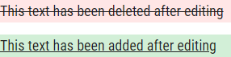
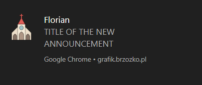
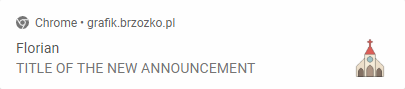

[Polish](README_pl.md) :point_left:

# Florian - the schedule

> A progressive web application with an administrative panel showing the schedule of Sunday Mass.

  

## Installation

The progressive web application (PWA) allows installations from a browser (Google Chrome recommended).
|Instruction |Attachment |
| ------------------------------------------------------ | :----------------------------------------: |
| 1. Visit https://florian-8cd60.web.app/ | |
| 2. In the address bar, press the "plus" symbol |  |
| 3. Select "Install"|

## Classifieds

The application displays the latest parish classifieds that are downloaded from the API of the official parish website.

| :exclamation: IMPORTANT :exclamation:                                                                                                                                                                                                                                                                                                 |
| ------------------------------------------------------------------------------------------------------------------------------------------------------------------------------------------------------------------------------------------------------------------------------------------------------------------------------------- |
| The free [Firebase Spark](https://firebase.google.com/pricing#cloud-functions) plan as part of [Firebase Cloud Functions](https://firebase.google.com/products/functions) limits customer queries only to Google services. For this reason, an additional, independent server was created using Google Sheets and Google Apps Script. |

### Classifieds labels

Advertisements may have the following types of labels:

| Label name  |                        Label                        | Condition for the label to be present                                                                        |
| ----------- | :-------------------------------------------------: | ------------------------------------------------------------------------------------------------------------ |
| **New**     |          | Occurs for 48 hours from publishing the announcement.                                                        |
| **Updated** |  | Occurs when the publication, published on the official parish website, has been edited by the administrator. |

### Updated publication

A previously published announcement may be updated over time. For this reason, the application, in addition to sending a notification and marking such a publication with an appropriate label, allows you to preview changes in the content of the message. For this purpose, the [Diff Match and Patch](https://github.com/google/diff-match-patch) tool was used.

## Notifications

The application allows, after obtaining the user's permission, to receive notifications informing about the fact of adding a new parish announcement.

| Browser               |                           Notification                           |
| --------------------- | :--------------------------------------------------------------: |
| Google Chrome Desktop |        |
| Google Chrome Mobile  |  |

## Administrator panel

For various reasons, the parish schedule sometimes shifts. For this reason, it is also necessary to move the schedule in the application. The administration panel allows authorized persons to perform such action.

|  |  |
| :---------------------------------------: | :---------------------------------------------------: |
|     _Panel view as authorized person_     |                _Panel view as a guest_                |

 

Logging in to the panel is done using [FirebaseUI](https://github.com/firebase/firebaseui-web).

[Firebase Realtime Database Rules](https://firebase.google.com/docs/database/security) are responsible for verifying user's permission to make changes.

## Meta

Łukasz Brzózko – lukasz@brzozko.pl

Distributed under the MIT license. See `LICENSE` for more information.

[https://github.com/lukasz-brzozko](https://github.com/lukasz-brzozko)
